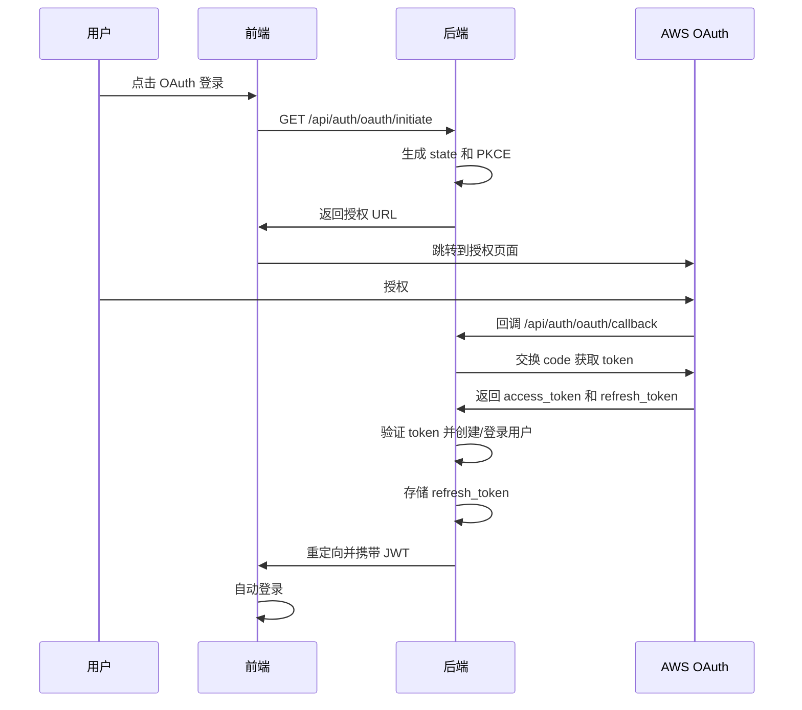

# OAuth 认证实现说明

## 改造概述

本项目已成功改造为支持 AWS OAuth 认证，可以自动获取 refresh token。实现参考了 [AIClient-2-API](https://github.com/justlovemaki/AIClient-2-API) 项目的思路。

## 主要变更

### 1. 后端新增文件

```
server/src/
├── controllers/
│   └── oauthController.js      # OAuth 控制器
├── utils/
│   ├── oauthHelper.js          # OAuth 工具函数
│   └── migrate.js              # 数据库迁移脚本
└── routes/
    └── auth.js                 # 更新：添加 OAuth 路由
```

### 2. 前端更新

- `src/pages/Login.tsx` - 添加 OAuth 登录按钮
- `src/pages/Login.css` - 添加 OAuth 按钮样式

### 3. 数据库变更

- `tokens` 表新增 `user_id` 字段，关联用户

### 4. 配置文件

- `server/.env.example` - 添加 `OAUTH_REDIRECT_URI` 配置

## 核心功能

### OAuth 流程



### 关键实现

#### 1. PKCE 安全增强

```javascript
// 生成 code_verifier
const codeVerifier = crypto.randomBytes(32).toString('base64url');

// 生成 code_challenge
const codeChallenge = crypto
  .createHash('sha256')
  .update(codeVerifier)
  .digest('base64url');
```

#### 2. Token 交换

```javascript
// 使用授权码交换 token
const tokens = await exchangeCodeForToken(code, codeVerifier);
// 返回: { accessToken, refreshToken, expiresIn }
```

#### 3. 自动用户管理

- 首次 OAuth 登录自动创建用户
- 使用邮箱作为用户名
- 自动关联 refresh token

## 使用方法

### 开发环境

1. **配置环境变量**

```bash
cd server
cp .env.example .env
```

编辑 `.env`：
```env
OAUTH_REDIRECT_URI=http://localhost:3001/api/auth/oauth/callback
```

2. **启动服务**

```bash
# 后端
cd server
npm install
npm start

# 前端（新终端）
npm install
npm run dev
```

3. **测试 OAuth 登录**

- 访问 http://localhost:5173/login
- 点击「使用 AWS OAuth 登录」
- 完成 AWS 授权
- 自动登录并获取 refresh token

### 生产环境

1. **更新环境变量**

```env
OAUTH_REDIRECT_URI=https://your-backend.com/api/auth/oauth/callback
CORS_ORIGIN=https://your-frontend.com
COOKIE_SECURE=true
COOKIE_SAMESITE=none
TRUST_PROXY=true
```

2. **确保 HTTPS**

OAuth 回调必须使用 HTTPS。

## API 端点

### 初始化 OAuth

```http
GET /api/auth/oauth/initiate
```

**响应：**
```json
{
  "authUrl": "https://prod.us-east-1.auth.desktop.kiro.dev/authorize?...",
  "state": "random-state"
}
```

### OAuth 回调

```http
GET /api/auth/oauth/callback?code=xxx&state=xxx
```

自动处理并重定向到前端。

### 获取 OAuth 状态

```http
GET /api/auth/oauth/status
Authorization: Bearer <jwt-token>
```

**响应：**
```json
{
  "hasToken": true,
  "token": {
    "id": 1,
    "description": "OAuth 自动获取",
    "created_at": "2026-03-04T10:00:00.000Z"
  }
}
```

## 与原项目的兼容性

### 保留功能

✅ 传统用户名密码登录  
✅ 验证码验证  
✅ 手动添加 Token  
✅ Token 管理  
✅ API 密钥管理  
✅ 所有现有 API 端点  

### 新增功能

✅ OAuth 登录  
✅ 自动获取 refresh token  
✅ 多用户支持  
✅ Token 与用户关联  

## 技术栈

- **OAuth 2.0** - 标准授权协议
- **PKCE** - 安全增强
- **JWT** - 用户认证
- **SQLite** - Token 存储
- **Express** - 后端框架
- **React** - 前端框架

## 安全考虑

1. **PKCE** - 防止授权码拦截
2. **State 参数** - 防止 CSRF 攻击
3. **Session 过期** - OAuth 会话 10 分钟过期
4. **Token 验证** - 获取后立即验证
5. **HTTPS** - 生产环境强制使用

## 测试

### 手动测试

```bash
# 测试 OAuth 初始化
curl http://localhost:3001/api/auth/oauth/initiate

# 测试健康检查
curl http://localhost:3001/health
```

### 自动测试脚本

```bash
chmod +x test-oauth.sh
./test-oauth.sh
```

## 故障排查

### OAuth 授权失败

**症状：** 点击 OAuth 登录后无响应

**检查：**
1. 后端是否运行：`curl http://localhost:3001/health`
2. 环境变量是否配置：检查 `.env` 文件
3. 浏览器控制台是否有错误

### 回调失败

**症状：** 授权后跳转到错误页面

**检查：**
1. `OAUTH_REDIRECT_URI` 是否正确
2. 后端日志是否有错误
3. State 参数是否匹配

### Token 无法使用

**症状：** 获取的 Token 检测失败

**检查：**
1. Token 是否已过期
2. AWS 账号是否有权限
3. 在 Token 管理页面点击「检测」查看详情

## 下一步优化

### 建议改进

1. **Token 自动刷新**
   - 后台定时任务
   - 避免 Token 过期

2. **IdC 认证支持**
   - 企业身份中心
   - 更多认证方式

3. **多账号绑定**
   - 一个用户绑定多个 AWS 账号
   - 账号切换功能

4. **OAuth 提供商扩展**
   - 支持其他 OAuth 提供商
   - 统一认证接口

## 参考资源

- [OAuth 2.0 规范](https://tools.ietf.org/html/rfc6749)
- [PKCE 规范](https://tools.ietf.org/html/rfc7636)
- [AIClient-2-API](https://github.com/justlovemaki/AIClient-2-API)
- [AWS CodeWhisperer](https://aws.amazon.com/codewhisperer/)

## 贡献者

感谢 [AIClient-2-API](https://github.com/justlovemaki/AIClient-2-API) 项目提供的思路和参考。

## 许可证

MIT License

---

**最后更新：** 2026-03-04  
**版本：** 1.0.0
